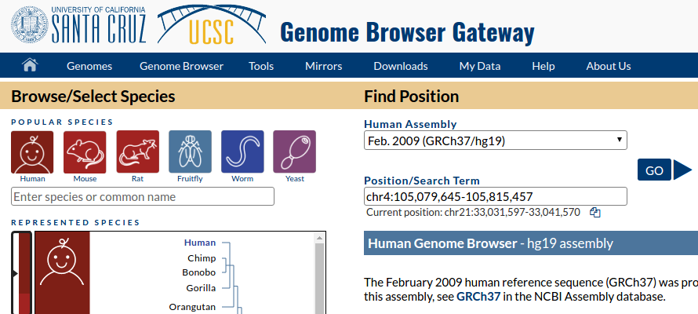
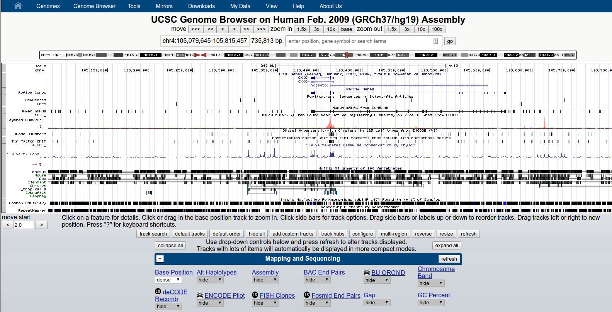
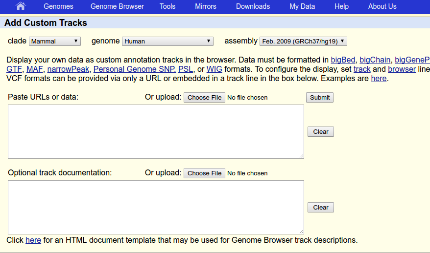

# Workshop 4: Epigenomics data &mdash; Visualization, Peak Calling, Quality Control, and Motif Finding

**Before leaving class today, please fill out this [anonymous feedback form](https://forms.gle/VYpzRu3jEW3KtaqR8) with your feedback on this BIOS201 course**

In today's workshop we will be analyzing some ATAC-seq data as an example of epigenomics data analysis. This analysis is fairly similar to what one might do with ChIP-seq or DNase-seq data.  

We will be working with ATAC-seq data from two hematopoeitic cell types &mdash; Natural Killer (NK) cells and Hematopoietic Stem Cells (HSC). For each cell type, we will use data from two different patients. This data is just a small subset of the data from this [paper](http://www.nature.com/ng/journal/v48/n10/abs/ng.3646.html).

We have already aligned and filtered the reads &mdash; we will be starting this analysis with bam files. Additionally, only reads mapping to chr4 have been retained, in the interest of speeding up all the analyses.   

## Goals

- Plot fragment size distribution
- Make coverage and insertion tracks
- Visualize coverage in UCSC genome browser
- Plot aggregate insertion profile at transcription start sites
- Call peaks
- Visualize peaks in UCSC genome browser
- Manipulate peak files &mdash; intersections and merges
- Find motifs enriched in peaks
- Differential accessibility [optional] 

## Setup

Follow the setup steps outlined in the first workshop.
```
ssh <sunetID>@rice.stanford.edu
# e.g. ssh zappala@rice.stanford.edu
```

Once connected, run:
```
echo $SHELL
```

If the response is `tcsh`, run the following command:
```
source /afs/ir/class/bios201/setup/setup_tcsh.sh 
```

If the response is `bash`, run the following command:
```
source /afs/ir/class/bios201/setup/setup_bash.sh 
```

Then copy the workshop materials and `cd` into the copied directory:
```
cp -r /afs/ir/class/bios201/workshop4/ .
cd workshop4
```

## Fragment size distribution

First, let's take a look at the fragment size for each of our samples.  We will use the tool `bamPEFragmentSize` from the deepTools package. The [deepTools package](https://deeptools.readthedocs.io/en/latest/), developed by the Bioinformatics Facility at the Max Planck Institute for Immunobiology and Epigenetics, is a suite of tools for working with and visualizing next generation sequencing data. To learn more about the `bamPEFragmentSize` tool, read the [documentation](https://deeptools.readthedocs.io/en/latest/content/tools/bamPEFragmentSize.html).

The generic command we will be using is:
```
# EXAMPLE FORMAT - DO NOT RUN
# bamPEFragmentSize -b <bamfiles> \
                  -hist <plot output filename> \
                  --maxFragmentLength <maximum fragment length> \
                  -T <plot title>
```

To run this on all four of our bamfiles:

```
bamPEFragmentSize -b *.bam -hist fragmentSizes.png --maxFragmentLength 500 \
                  -T "Fragment sizes of ATAC-seq data"
```

To look at our fragment sizes, we will take advantage of the "WWW" folder in your afs-home directory. Copy the fragment sizes plot to that directory:

```
cp fragmentSizes.png ~/afs-home/WWW/
```
Now navigate in your web browser to  http://web.stanford.edu/~sunet/, filling in sunet with your own sunet id. You should see a list of files, including fragmentSizes.png.  Click on it to see the plot. 

:question: What is the most common fragment length?

:question: What does the peak at around 200 bp likely represent?

## Making coverage track

For visualizing ATAC-seq data, it can be helpful to make a "coverage" track showing how many fragments map to a particular region of the genome. We will be using the `bamCoverage` tool from the deepTools suite to make coverage tracks. To learn about all the options, check out the [bamCoverage documenation](https://deeptools.readthedocs.io/en/latest/content/tools/bamCoverage.html).

We will first use the following set of options to create a binned set of 
```
# EXAMPLE FORMAT -- DO NOT RUN
# bamCoverage --bam <input.bam> -o <output> --binSize 100 --normalizeUsingRPKM --extendReads
```
To do this for one of our bam files:

```
bamCoverage --bam Donor2596-NK.chr4.bam -o Donor2596-NK.chr4.bw --binSize 100 --normalizeUsingRPKM --extendReads
```

Now run the bamCoverage for the other three bam files as well, changing the `--bam` and `-o` arguments as appropriate.  

We will also use the bamCoverage tool to create a per base track of ATAC-seq insertions. This is the precise base pair that represents the center of where the Tn5 transposon bound the DNA.  That position is 5 base pairs from the start of the read, so we use `--Offset 5 5` to get only that base pair.  We use `-binSize 1` to specfiy single base resolution:

```
bamCoverage --bam Donor2596-NK.chr4.bam -o Donor2596-NK.ins.bw  --binSize 1 --Offset 5 5
```

This command takes a while so we'll run it only one sample.

## Using the UCSC Genome Browser to visualize the data

We are going to use the UCSC Genome Browser to visualize our ATAC-seq data. First, navigate to the [UCSC Genome Browser](https://genome.ucsc.edu/cgi-bin/hgGateway).  For genome build, select "Feb. 2009 GCRCh37/hg19".  For region, type in `chr4:105,079,645-105,815,457`.



Then click GO.  This will take you to a page that should look like this:



Take a minute to scroll down the page and see some of the different kinds of data that are available to display.  Try adding some additional information and changing the display settings for some of the default information.

Now we're going to add some of our own data.  Click on the 'add custom tracks' gray button that is in the middle below the tracks.  



We are going to give a URL pointing to our data.  To do that, we first have to copy the data to somewhere it is publically available. Copy all your bigwig files to your WWW folder:

``` 
cp *.bw ~/afs-home/WWW/
```

Now if you go to http://web.stanford.edu/~sunet/, fillling in sunet with your own sunet id, you will see a list of files.  Now enter http://web.stanford.edu/~sunet/Donor2596-NK.chr4.bw (again substituting sunet with your own id) into the `Paste URLs or data` box.  Then click `submit`. You will get taken to another screen, where you should click the `go` button next to view in `Genome Browser`. You should now see some data!

Explore different options for displaying the data, selected from the dropdown box in the custom tracks section:


Use the same procedure to add tracks for the other three samples.  You can add them all at once by pasting each link into the `Paste URLs or data` box.

:question: What is the max coverage for each sample in the chr4:105,079,645-105,815,457 window?

Play around with the zooming to view more or less of the data.

:question: Try adding the insertion track as well -- how does it compare to the coverage track for the same sample?

## Aggregating coverage at transcription start site (TSS)

We're going to go back to the terminal, but keep your UCSC genome browser open -- we'll come back to it.

We are now going to look at one type of QC plot &mdash; aggregating ATAC-seq insertions at the TSS to see if there is an enrichment.  We will use the `computeMatrix` and `plotHeatmap` commands from deepTools. 

```
computeMatrix reference-point -S Donor2596-NK.ins.bw \
  -R hg19.refGeneReviewedValidated.tss.chr4.bed \
  -o Donor2596-NK.matrix.gz --referencePoint TSS \
  --binSize 10 --missingDataAsZero -b 2000 -a 2000

plotHeatmap -m Donor2596-NK.matrix.gz -out Donor2596-NK_heatmap.png \
  --xAxisLabel 'Distance (bp)' --samplesLabel Insertions --zMin 0 -z ATAC
```

Copy `Donor2596-NK_heatmap.png` to your WWW folder and use your browser to take a look at the file.

:question: What is the approximate width of the peak at the TSS?

## Peak calling

The next step will be to call peaks for each sample. Peaks are areas of the genome where we have a pileup of signal &mdash; in ATAC-seq these represent "accessible" regions of the genome. You can probably visually identify some of these regions in the genome browser.

We will use the tool MACS2 to call peaks. [MACS2](https://github.com/taoliu/MACS), developed by Tao Liu (originally in Shirley Liu's group), has tools for modeling ChIP-seq data and for calling both "narrow" and "broad" peaks. Generally, for TF ChIP-seq, "narrow" peaks are appropriate while for histone modification ChIP-seq "broad" peaks are appropriate. For ATAC-seq, peaks can vary in size and depending on what you want do with the peaks it may make sense to call either broad or narrow peaks. For this tutorial, we will call narrow peaks using the `--call-summits` option to additionally call a "summit" in each peak-- this represents where the peak has the greatest intensity.  

Here we will use the following MACS2 options:

| option | description | 
| ------ | ------ |
| --treatment | name of the file(s) | 
| --name | name to use as prefix of output | 
| --format | what is file format | 
| --call-summits | also output summit positions |
| --keep-dup | count duplicates? | 
| -p |p value cutoff |
| -g | genome size -- normally we would use hg19 but we have subset the genome to only include chr4 | 
| --nomodel | don't compute model for fragment size |

To learn more about these options and the other available options, read through the [MACS2 documentation](https://github.com/taoliu/MACS)

For our first sample:

```
macs2 callpeak --treatment Donor2596-NK.chr4.bam --name Donor2596-NK --format BAMPE --nomodel --call-summits --nolambda --keep-dup all -q 0.01 -g 1.7e8
```

Now do the same for the other three bam files, replacing the `--treatment` and `--name` arguments.  

Note that we can also call peaks on multiple samples combined by giving more than one bam file to `--treatment`.  This generally makes sense when you have technical replicates.

Several different files are output with a few formats.  

:question: What kinds of files were output by MACS2?  What is the difference between the different formats?

:question: How many peaks are there for each sample? 
[hint: Remember the `wc` command...]

## Visualizing Peaks :mount_fuji:

We will focus on the narrowPeak files.  To learn about this format, read the [description](https://genome.ucsc.edu/FAQ/FAQformat#format12).

To be able to visualize the narrowPeak files in UCSC Genome Browser, we have to add a line at the top of the file indicating the track type.  We will also add a name.  

``` 
echo 'track type=narrowPeak name="Donor2596 NK Peaks"' | cat - Donor2596-NK_peaks.narrowPeak > \
      ~/afs-home/WWW/Donor2596-NK_peaks.narrowPeak 
```

Then add the tracks to your UCSC genome browser session by pasting the appropriate link.

:question: How many peaks are there in the window: chr4:105,410,415-105,419,498? How many summits?

## Manipulating peak files

We can use tools from the bedtools suite to do things like merge nearby peaks, find intersection between peaks in two different bam files and much more.

Let's try finding the intersection between peak files -- the sections of peaks that are shared between two sets of peaks.   

Read the documentation for the bedtools intersect command, either using `bedtools intersect --help` on the command line or by navigating to the [online documentation](https://bedtools.readthedocs.io/en/latest/content/tools/intersect.html).  

Find the intersection between the two NK samples and between the two HSC samples:

```
bedtools intersect -a Donor2596-NK_peaks.narrowPeak -b Donor5483-NK_peaks.narrowPeak > NK_intersection.bed

bedtools intersect -a Donor7256-HSC_peaks.narrowPeak -b Donor4983-HSC_peaks.narrowPeak > HSC_intersection.bed

```

Now let's get the union of all the peaks and merge overlapping peaks.  First, let's combine the peaks for all our samples into one file and sort the result using the bedtools sort command:

```
cat *.narrowPeak | bedtools sort -i stdin > all_peaks.bed
```

Read the documentation for the bedtools merge command, either using `bedtools merge --help` on the command line or by navigating to the [online documentation](https://bedtools.readthedocs.io/en/latest/content/tools/merge.html).  

Use what you learned from the documentation of the merge command to merge overlapping peaks in `all_peaks.bed`.  

:question: How many peaks are in the merged peak files?

## Finding motifs in peaks

We will next find motifs enriched in the NK peaks.  We will use the intersection of the peaks from both samples. For finding motifs we will use the findMotifsGenome.pl script from the HOMER package.  To learn more about the options and figure out the format of the output, read the [documentation](http://homer.ucsd.edu/homer/ngs/peakMotifs.html). Here is the command you would run, however it takes quite a while to run, so instead we will just explore the output.  

```
# Slow - do not run during workshop
findMotifsGenome.pl NK_intersection.bed chr4.fa NK_motifs -size given

findMotifsGenome.pl HSC_intersection.bed chr4.fa HSC_motifs -size given
```

The output have been added to the class WWW folder and can be found at http://web.stanford.edu/class/bios201/workshop4. Take some time to explore the output, referring to the HOMER documentation for help with the format.   

:question: What is the the most enriched known motif in the NK peaks? In the HSC peaks?

## Feedback form

**Before leaving class today, please fill out this [anonymous feedback form](https://goo.gl/forms/PNjPd0m3Q0jQp6KE2) with your feedback on this BIOS201 course**

## Finding differential peaks [optional challenge]

The `multicov` command from bedtools can be used to count how many reads aligned to each peaks:

```
bedtools multicov -bams Donor2596-NK.chr4.bam Donor5483-NK.chr4.bam Donor7256-HSC.chr4.bam Donor4983-HSC.chr4.bam \
  -bed all_peaks.merged.bed > peak_counts.bed

# Replace all_peaks.merged.bed with whatever you called the merged peaks
```
This command will create a file with the counts of reads for each bamfile

Use what you learned from the previous workshop about calling differential expression to calling differential peak accessibility. The approach is pretty similar for ATAC-seq than for RNA-seq, you would just use read counts in peaks rather than read counts in genes.

Find the motifs enriched in your set of differential peaks relative to all peaks.

## Learning more

The page https://github.com/crazyhottommy/ChIP-seq-analysis has links to a lot of resources for analysis of ChIP-seq, ATAC-seq, and other epigenomics data types.


